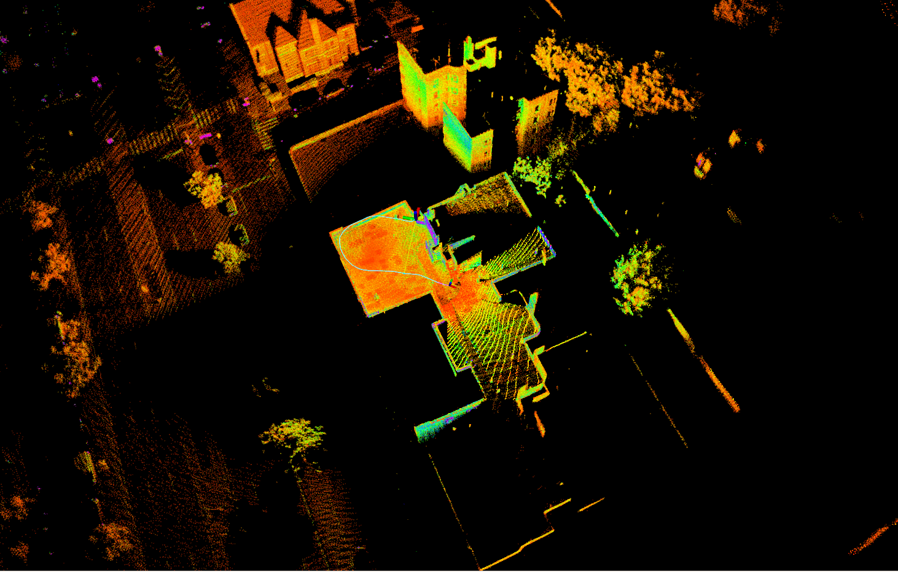

# LIO_SAM

### Environmental Settings (Docker)

- Build docker image from Dockerfile
    - LIO_SAM and requirements will be installed in the docker image.
    ```bash
    docker build docker_files/LIO-SAM -t lio:demo
    ```

- Make container
  
  ```
    docker run -it -v /tmp/.X11-unix:/tmp/.X11-unix \
    -e DISPLAY=$DISPLAY -e USER=$USER \
    -e runtime=nvidia -e NVIDIA_DRIVER_CAPABILITIES=all -e \
    NVIDIA_VISIBLE_DEVICES=all \
    --net host --gpus all --privileged \
    --name lio lio:demo /bin/bash
  ```

  
### RUN
#### With demo data
- Download Data
   - We should Download Dataset for LIO-SAM
     - Enter https://drive.google.com/drive/folders/1gJHwfdHCRdjP7vuT556pv8atqrCJPbUq
     - Download rooftop_ouster_dataset.bag for test
  - copy dataset to docker environment
    - type this command to local terminal
       ```bash
       docker cp Downloads/rooftop_ouster_dataset.bag lio:/dataset
       ```
  
- Run LIO-SAM with demo data
  - To run and visualize LIO-SAM, we need two terminals
    - One to launch LIO-SAM
    - One to play rosbag file.
  - Open two terminals and insert the command below to access the docker container.
    ```bash
    docker exec -it lio /bin/bash
    ```
  - Terminal 1(launch LIO-SAM)
    ```bash
    roslaunch lio_sam run.launch
    ```
  - Terminal 2(play rosbag file)
    ```bash
    rosbag play /dataset/rooftop_ouster_dataset.bag
    ```
- Expected Results
  

#### With user's own LiDAR
- Edit config file(LIO-SAM/config/params.yaml)
  - Topic names
    - Align topic names
    ```yaml
    lio_sam:
    # Topics
    pointCloudTopic: "Pointcloud 토픽명 ex)ouster/points"               # Point cloud data
    imuTopic: "IMU 토픽명 ex)imu"                                       # IMU data
    odomTopic: "odometry/imu"                                          # IMU pre-preintegration odometry, same frequency as IMU
    gpsTopic: "odometry/gpsz"
    ```
  - LiDAR configuration
    ```yaml
    # Sensor Settings
    sensor: ouster                            # lidar sensor type, 'velodyne' or 'ouster' or 'livox'
    N_SCAN: 64             <---- Edit                     # number of lidar channel (i.e., Velodyne/Ouster: 16, 32, 64, 128, Livox Horizon: 6)
    Horizon_SCAN: 1024     <---- Edit                     # lidar horizontal resolution (Velodyne:1800, Ouster:512,1024,2048, Livox Horizon: 4000)
    downsampleRate: 1                           # default: 1. Downsample your data if too many points. i.e., 16 = 64 / 4, 16 = 16 / 1
    lidarMinRange: 1.0                          # default: 1.0, minimum lidar range to be used
    lidarMaxRange: 1000.0
    ```
  - LiDAR - IMU calibration
    - Get extrinsic parameters between LiDAR and IMU by utilizing this [repository](https://github.com/chennuo0125-HIT/lidar_imu_calib.git).
      - We can get only extrinsic rotation parameters by using this repo.
    - Then edit extrinsic parameters in the configuration file.
    ```yaml
    # Extrinsics: T_lb (lidar -> imu)
      extrinsicTrans: [0.0, 0.0, 0.0]            
      extrinsicRot: [-1, 0, 0,   
                      0, 1, 0,
                      0, 0, -1]
      extrinsicRPY: [0, -1, 0,
                    1, 0, 0,
                    0, 0, 1]
    ```

### Known issues
- "docker exec -it lio /bin/bash" is not working with below error message.
    ```bash
    Error response from daemon: Container 13b80ddc4587e65441f690bc6c011eeb5626b01addabb4ebcb2c0386c595135b is not running
    ```
    - This issue occurs because the Docker container has been terminated. One need to run docker container with the command below.
        ```bash
        docker start lio
        ```
- rviz is not working with below error message.
  ```bash
  qt.qpa.screen: QXcbConnection: Could not connect to display :0
  Could not connect to any X display.
  ```
  - run this command on "original environment", not on container.
    ```bash
    xhost +
    ```